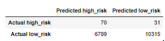
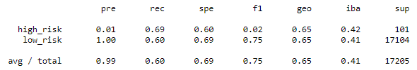
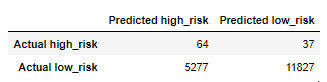
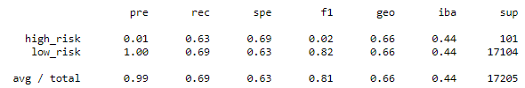
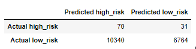
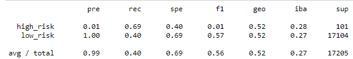
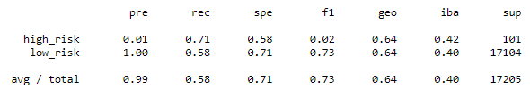
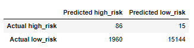
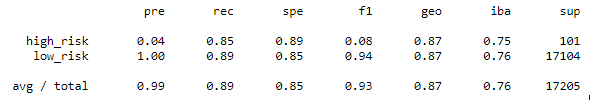
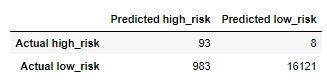

# Credit Risk Analysis

## Project Overview
The purpose of this project was to analyze credit risk using 6 different machine learning models and evaluate which model would be recommended for the analysis. The models are listed below: 
- **Oversample**: RandomOverSampler, SMOTE (Synthetic Minority Oversampling Technique)
- **Undersample**: ClusterCentroids 
- **Combinatorial approach**: SMOTEENN (SMOTE and Edited Nearest Neighbors)
- **Reduce bias**: BalancedRandomForestClassifier, EasyEnsembleClassifier

Each model imported data from "LoanStats_2019Q1.csv", dropping empty columns and rows, converting string type data into numerical data, splitting the data into training and testing sets, and then calculating the predictions.

## Results
The results for each model contain images of their confusion matrix and imbalanced classification report as well as a brief description of their outputs. A confusion matrix is a summary of prediction results (correct and incorrect prediction counts) on a classification problem. An imbalanced classification report summarizes each classification when there is an unequal distribution of classes in the training dataset.

Balanced accuracy is a metric that one can use when evaluating how good a binary classifier is.
Recall is the measure of our model correctly identifying True Positives.

### 1. RandomOverSampler

Confusion Matrix 
 

Imbalanced Classification Report 

 Balanced accuracy score:
 High risk precision:
 Low risk precision:
 Recall score:

### 2. SMOTE (Synthetic Minority Oversampling Technique)

Confusion Matrix 
 

Imbalanced Classification Report 

 Balanced accuracy score:
 High risk precision:
 Low risk precision:
 Recall score:

### 3. ClusterCentroids

Confusion Matrix 
 

Imbalanced Classification Report 

 Balanced accuracy score:
 High risk precision:
 Low risk precision:
 Recall score:

### 4. SMOTEENN (SMOTE and Edited Nearest Neighbors)

Confusion Matrix 
 

Imbalanced Classification Report 

 Balanced accuracy score:
 High risk precision:
 Low risk precision:
 Recall score:

### 5. BalancedRandomForestClassifier

Confusion Matrix 
 

Imbalanced Classification Report 

 Balanced accuracy score:
 High risk precision:
 Low risk precision:
 Recall score:

### 6. EasyEnsembleClassifier

Confusion Matrix 
 

Imbalanced Classification Report 

 Balanced accuracy score:
 High risk precision:
 Low risk precision:
 Recall score:

## Summary
None of these models are good fit for credit risk because....
