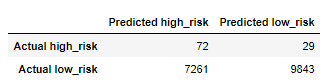
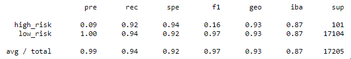

# Credit Risk Analysis

## Project Overview
The purpose of this project was to analyze credit risk using 6 different machine learning models and evaluate which model would be recommended for the analysis. The models are listed below: 
- **Oversample**: RandomOverSampler, SMOTE (Synthetic Minority Oversampling Technique)
- **Undersample**: ClusterCentroids 
- **Combinatorial approach**: SMOTEENN (SMOTE and Edited Nearest Neighbors)
- **Reduce bias**: BalancedRandomForestClassifier, EasyEnsembleClassifier

Each model imported data from "LoanStats_2019Q1.csv", dropping empty columns and rows, converting string type data into numerical data, splitting the data into training and testing sets, and then calculating the predictions.

## Results
The results for each model contain images of their confusion matrix and imbalanced classification report as well as a brief description of their outputs. A confusion matrix is a summary of prediction results (correct and incorrect prediction counts) on a classification problem. An imbalanced classification report summarizes each classification when there is an unequal distribution of classes in the training dataset.

Balanced accuracy is a metric that one can use when evaluating how good a binary classifier is.
F1 Score is the weighted average of Precision and Recall. Therefore, this score takes both false positives and false negatives into account.
Recall is the measure of our model correctly identifying True Positives.

### 1. RandomOverSampler

Confusion Matrix 
 

Imbalanced Classification Report 

 - Balanced accuracy score: 65%
 - High risk precision: 1%
 - F1 score: 2%
 - Recall score: 60%

### 2. SMOTE (Synthetic Minority Oversampling Technique)

Confusion Matrix 
 

Imbalanced Classification Report 

 - Balanced accuracy score: 66%
 - High risk precision: 1%
 - F1 score: 2%
 - Recall score: 69%

### 3. ClusterCentroids

Confusion Matrix 
 

Imbalanced Classification Report 

 - Balanced accuracy score: 54%
 - High risk precision: 1%
 - F1 score: 1%
 - Recall score: 40%

### 4. SMOTEENN (SMOTE and Edited Nearest Neighbors)

Confusion Matrix 
 

Imbalanced Classification Report 

 - Balanced accuracy score: 64%
 - High risk precision: 1%
 - F1 score: 2%
 - Recall score: 58%

### 5. BalancedRandomForestClassifier

Confusion Matrix 
 

Imbalanced Classification Report 

 - Balanced accuracy score: 87%
 - High risk precision: 4%
 - F1 score: 8%
 - Recall score: 85%

### 6. EasyEnsembleClassifier

Confusion Matrix 
 

Imbalanced Classification Report 

 - Balanced accuracy score: 93%
 - High risk precision: 9%
 - F1 score: 16%
 - Recall score: 94%

## Summary
None of these models are good fit for credit risk because....
